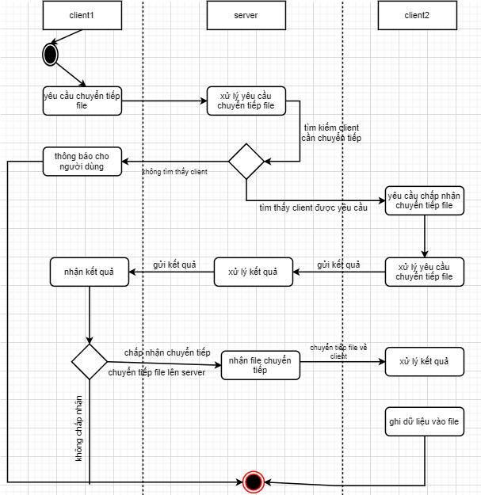

<h1 align="center">
  Network Programing
</h1>

1. [Tổng quan đề tài](#section1)
2. [Cấu trúc chương trình](#section2)
   1. [Client](#section2.1)
   2. [Server](#section2.2)
3. [Khuôn dạng gói tin và cách truyền tin](#section3)
   1. [Khuôn dạng gói tin](#section3.1)
   2. [cách truyền tin](#section3.2)
4. [Use Case](#section4)
   1. [Biểu đồ use case](#section4.1)
   2. [Use case kết nối tới server](#section4.2)
   3. [Use case chuyển tiếp dữ liệu](#section4.3)
   4. [Use case tìm kiếm file](#section4.4)
5. [Biểu đồ hoạt động](#section5)
   1. [Kết nối tới server](#section5.1)
   2. [Chuyển tiếp file](#section5.2)
   3. [Tìm kiếm file](#section5.3)
6. [Giao diện chương trình](#section6)
   1. [Server](#section6.1)
   2. [Client](#section6.2)
7. [Tài liệu tham khảo](#section7)

---

## 1. Tổng quan đề tài<a name="section1"></a>

#### 1.1. Tên đề tài: xây dựng ứng dụng chia sẻ file 1

- Server có các chức năng:
  - Xử lý yêu cầu kết nối của client, trả về ID cho client đó
  - Nhận yêu cầu tìm kiếm file theo tên của client A nào đó
  - Gửi lệnh tìm kiếm tới các client khác đang kết nối
  - Gửi lại cho client A danh sách các client có file mà client A tìm kiếm
- Client có các chức năng:
  - Gửi yêu cầu tìm kiếm một file lên server
  - Nhận danh sách các client có file mà client đó yêu cầu tìm kiếm
  - Lựa chọn ra một client trong số đó để yêu cầu download file
  - Yêu cầu server chuyển tiếp file đến client khác
  - Thực hiện tìm kiếm file theo yêu cầu của client khác(sẽ tìm kiếm file trong thư mục Data nằm cùng thư mục với file .exe của client). Cụ thể, client sẽ tìm kiếm đệ quy vào thư mục Data(tìm kiếm tất cả các file nằm trong Data và các thư mục con của Data)

#### 1.2. Ngôn ngữ sử dụng: C, C++

#### 1.3. Trình biên dịch sử dụng: Visual Studio 2015

---

## 2. Cấu trúc chương trình<a name="section2"></a>

- Chương trình xây dựng theo hướng cấu trúc, bao gồm hai project là Client và Server

#### 2.1. Client<a name="section2.1"></a>

#### _2.1.1. Header File_

| File                                      | Ý nghĩa                                                                                                                                    |
| :---------------------------------------- | :----------------------------------------------------------------------------------------------------------------------------------------- |
| [Config.h](./CLIENT/Config.h)             | chứa những hằng số của chương trình client                                                                                                 |
| [Common.h](./CLIENT/Common.h)             | chứa những cấu trúc(struct) và tiêu đề hàm có chức năng chung của chương trình client                                                      |
| [InteractFile.h](./CLIENT/InteractFile.h) | chứa những cấu trúc và tiêu đề hàm có chức năng tương tác với file(lấy tên file, tìm kiếm file, đọc file, kiểm tra sự tồn tại của file, …) |
| [TCPSocket.h](./CLIENT/TCPSocket.h)       | chứa những cấu trúc và tiêu đề hàm có chức năng định nghĩa khuôn dạng gói tin, cách đóng gói và cách truyền tin trong chương trình         |

#### _2.1.2. Resource File and Source File_

| File                                          | Ý nghĩa                                                                                                                                       |
| :-------------------------------------------- | :-------------------------------------------------------------------------------------------------------------------------------------------- |
| [Common.cpp](./CLIENT/Common.cpp)             | định nghĩa các hàm được khai báo trong Common.h                                                                                               |
| [InteractFile.cpp](./CLIENT/InteractFile.cpp) | định nghĩa các hàm được khai báo trong InteractFile.h                                                                                         |
| [TCPSocket.cpp](./CLIENT/TCPSocket.cpp)       | định nghĩa các hàm được khai báo trong TCPSocket.h                                                                                            |
| [WinMain.cpp](./CLIENT/WinMain.cpp)           | chứa hàm WinMain(hàm chính) của chương trình client đồng thời có chức năng tạo giao diện, tương tác với người dùng và xử lý yêu cầu từ server |

#### 2.2. Server<a name="section2.2"></a>

#### _2.2.1. Header File_

| File                                | Ý nghĩa                                                                                                                        |
| :---------------------------------- | :----------------------------------------------------------------------------------------------------------------------------- |
| [Config.h](./SERVER/Config.h)       | chứa những hằng số của chương trình server                                                                                     |
| [Common.h](./SERVER/Common.h)       | chứa những cấu và tiêu đề hàm có chức năng chung của chương trình server                                                       |
| [TCPSocket.h](./SERVER/TCPSocket.h) | chứa những cấu trúc và tiêu đề có chức năng định nghĩa khuôn dạng gói tin, cách đóng gói và cách truyền tin trong chương trình |

#### _2.2.2. Resource File and Source File_

| File                                    | Ý nghĩa                                                                                                                            |
| :-------------------------------------- | :--------------------------------------------------------------------------------------------------------------------------------- |
| [Common.cpp](./SERVER/Common.h)         | định nghĩa các hàm được khai báo trong Common.h                                                                                    |
| [TCPSocket.cpp](./SERVER/TCPSocket.cpp) | định nghĩa các hàm được khai báo trong TCPSocket.h                                                                                 |
| [Server.cpp](./SERVER/Server.cpp)       | chứa hàm main của chương trình phía server, có chức năng quản lý các phiên đăng nhập của các client và xử lý các yêu cầu từ client |

---

## 3.Khuôn dạng gói tin và cách truyền tin<a name="section3"></a>

#### 3.1 Khuôn dạng gói tin<a name="section3.1"></a>

- Khuôn dạng dược định nghĩa bằng một cấu trúc có 5 trường

  ```c
  struct Message {
      int type;
      char fileName[BUFF_SIZE];
      char ID[BUFF_SIZE];
      char data[BUFF_SIZE + 1];
      int dataLen;
      };
      (BUFF_SIZE là 10240)
  ```

- type: xác định chức năng mà client và server phải thực hiện

#### _3.1.1. Server_

| Mã   | Ý nghĩa                                                                                      |
| :--- | :------------------------------------------------------------------------------------------- |
| 100  | kết nối thành công, gửi ID lại cho client                                                    |
| 110  | gửi danh sách các client đang kết nối                                                        |
| 111  | gửi danh sách các client có file yêu cầu về client đang tìm kiếm file đấy                    |
| 112  | tải từng gói dữ liệu của file tìm kiếm về client đi kèm kích thức của gói dữ liệu đó         |
| 1120 | có chức năng giống 112 nhưng là dấu hiệu của việc kết thúc truyền file về client             |
| 120  | gửi yêu cầu tìm kiếm file từ một client đến các client còn lại                               |
| 121  | gửi yêu cầu tải file lên server đến client được chỉ định trong chức năng tìm kiếm file       |
| 200  | yêu cầu chuyển tiếp file về client                                                           |
| 201  | tải từng gói dữ liệu của file chuyển tiếp về client đi kèm với kích thước của gói dữ liệu đó |
| 2010 | có chức năng giống 201 nhưng là dấu hiệu của việc kết thúc truyền file về client             |
| 202  | ID do client gửi lên có thể kết nối và được phép chuyển tiếp                                 |
| 203  | ID do client gửi lên không thể kết nối hoặc bị từ chối chuyển tiếp                           |

#### _3.1.2. Client_

| Mã   | Ý nghĩa                                                                                                              |
| :--- | :------------------------------------------------------------------------------------------------------------------- |
| 300  | yêu cầu kết nối và yêu cầu server gửi ID                                                                             |
| 310  | gửi yêu cầu tìm kiếm file                                                                                            |
| 311  | tải từng gói dữ liệu file từ client được chỉ định bởi client khác lên server đi kèm với kích thức của gói dữ liệu đó |
| 3110 | có chức năng giống 311 nhưng là dấu hiệu của việc kết thúc truyền file lên server                                    |
| 312  | chỉ định một client để tải file đang tìm kiếm                                                                        |
| 320  | không tìm thấy tên file mà server yêu cầu                                                                            |
| 321  | tìm thấy tên file mà server yêu cầu                                                                                  |
| 400  | gửi ID và fileName để yêu cầu chuyển tiếp file đến client tương ứng với ID được gửi                                  |
| 401  | gửi lần lượt từng gói dữ liệu file chuyển tiếp lên server đi kèm với kích thước của gói dữ liệu đó                   |
| 4010 | có chức năng giống 401 nhưng là dấu hiệu của việc kết thúc truyền file lên server                                    |
| 410  | không cho chuyển tiếp file về client                                                                                 |
| 411  | cho phép chuyển tiếp file về client                                                                                  |

| Trường dữ liệu | Ý nghĩa                                                                                                                                                                             |
| :------------- | :---------------------------------------------------------------------------------------------------------------------------------------------------------------------------------- |
| fileName       | chứa thông tin tên file                                                                                                                                                             |
| ID             | chứa thông tin ID của client(ID của client cần chuyển tiếp hoặc yếu cầu chuyển tiếp, hoặc của client thực hiện tìm kiếm file hoặc client được yêu cầu tải file tìm kiếm lên server) |
| data           | chứa dữ liệu của file                                                                                                                                                               |
| dataLen        | kích thức của trường data                                                                                                                                                           |

#### 3.2. Cách truyền tin<a name="section3.2"></a>

Sử dụng tcp socket và kỹ thuật truyền dòng để truyền tin giữa client và server

---

## 4. Use Case<a name="section4"></a>

#### 4.1. Biểu đồ user case<a name="section4.1"></a>


#### 4.2. Use case kết nối tới server<a name="section4.2"></a>

#### _4.2.1. Đối tượng sử dụng use case: người dùng chương trình_

#### _4.2.2. tóm tắt: người dùng sử dụng use case này để kết nối tới server và nhận ID từ server_

#### _4.2.3. Dòng sự kiện_

1. Hệ thống hiển thị giao diện ban đầu
2. Người dùng thực hiện kết nối bằng việc nhập thông tin IP và số hiệu cổng của server, sau đó bấm Connect
3. Nếu kết nối thành công , server sẽ gửi trả ID của người dùng
4. Nếu không thành công hệ thống sẽ báo lỗi, yêu cầu kết nối lại

#### 4.3. Use case chuyển tiếp dữ liệu<a name="section4.3"></a>

#### _4.3.1. Đối tượng sử dụng use case: người dùng chương trình_

#### _4.3.2. Tóm tắt: người dùng sử dụng use case để chuyển tiếp file đến client khác_

#### _4.3.3. Dòng sự kiện_

1. Use case bắt đầu khi người dùng bấm browse chọn file cần chuyển tiếp và bấm forward để chuyển tiếp file
2. Hệ thống sẽ yêu cầu nhập ID của người muốn chuyển tiếp
3. Sau khi nhập ID, bấm forward một lần nữa
4. Server sẽ tìm kiếm client được client kia yêu cầu, nếu tìm thấy server sẽ yêu cầu được chuyển tiếp file về client đó, nếu không tìm thấy thông báo về cho client yêu cầu chuyển tiếp, kết thúc use case
5. Nếu yêu cầu chuyển tiếp được chấp nhận, bắt đầu chuyển tiếp file về client đó, nếu không chấp nhận thì thông báo về cho client yêu cầu chuyển tiếp, kết thúc use case

#### _4.3.4. Luồng ngoại lệ: nếu client được yêu cầu chuyển tiếp chính là client yêu cầu chuyển tiếp thì báo lỗi cho người dùng, kết thúc use case_

#### 4.4. Use case tìm kiếm file<a name="section4.4"></a>

#### _4.4.1. Đối tượng sử dụng use case: người sử dụng chương trình_

#### _4.4.2. Tóm tắt: người dùng sử dụng use case để tìm kiếm file ở các client khác_

#### _4.4.3. Dòng sự kiện_

1. Use case bắt đầu khi người dùng nhập tên file cần chuyển tiếp và bấm nút search
2. Server sẽ gửi yêu cầu tìm kiếm này tới các client khác
3. Nếu tìm thấy, server sẽ gửi trả client yêu cầu tìm kiếm danh sách các client có thể tải file cần tìm kiếm, client sẽ chọn một chient trong số đó để yêu cầu tải file
4. Nếu không tìm thấy, server sẽ thông báo cho client, client sẽ hiện thông báo cho người dùng

## 5. Biểu đồ hoạt động<a name="section5"></a>

#### 5.1. Kết nối tới server<a name="section5.1"></a>


#### 5.2. Chuyển tiếp file<a name="section5.2"></a>



#### 5.3. Tìm kiếm file<a name="section5.3"></a>


## 6. Giao diện chương trình<a name="section6"></a>

#### 6.1. Server<a name="section6.1"></a>

Server là console, không có giao diện

#### 6.2. Client<a name="section6.2"></a>

#### 6.3. Giao diện khởi tạo


#### 6.4. Giao diện sau kho đăng nhập thành công


#### 6.5. Giao diện chuyển tiếp file


#### 6.6. Giao diện danh sách Id Client có file tìm kiếm


## 7. tài liệu tham khảo<a name="section7"></a>

- https://docs.microsoft.com/en-us/windows/win32/controls/user-controls-intro
- https://stackoverflow.com/questions/7598067/how-to-create-a-windows-style-textbox-in-a-c-win32-application
- https://stackoverflow.com/questions/8520560/get-a-file-name-from-a-path
- https://stackoverflow.com/questions/2886609/how-to-make-multiple-windows-using-win32-api#:~:text=5%20Answers&text=You%20can%20hit%20CreateWindow(),1st%20one%20if%20you%20want.
- https://docs.microsoft.com/en-us/windows/win32/api/winuser/nf-winuser-messagebox
- https://stackoverflow.com/questions/42046666/test-project-exe-has-triggered-a-breakpoint
- https://stackoverflow.com/questions/42438135/c-winapi-listbox-getting-selected-item-using-lb-getsel-lb-getcursel
- https://docs.microsoft.com/en-us/windows/win32/learnwin32/closing-the-window
